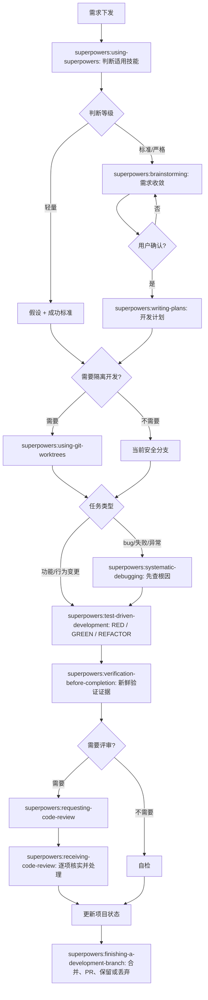

# 移动端开发工作流

本文档定义 `showroom_flutter` 的 AI 协作开发工作流。主流程基于 Superpowers 子技能，项目原则只有一句：流程服务于开发，交付物服务于决策和验证。能用一次对话、一个清单、一条验证记录说清楚的事情，不额外写长文档。

## 1. 流程分级

默认先判断任务等级，再决定要走多少流程。

| 等级 | 适用场景 | 必走节点 | 交付物 |
| --- | --- | --- | --- |
| 轻量 | 文档、注释、小配置、单文件无行为变更 | 假设与成功标准、修改、最小验证 | 对话记录即可，必要时更新状态文档 |
| 标准 | 常规功能、bug fix、UI 状态变化、跨 2-4 个文件 | `superpowers:brainstorming`、`superpowers:writing-plans`、worktree、TDD 或系统调试、质量门、状态更新 | `brief` 或一页计划 |
| 严格 | 架构、平台配置、发布、多会话并行、高风险能力 | 完整需求收敛、完整计划、独立 worktree、分层测试、评审、收尾决策 | `docs/plans/` 文档、验证和评审证据 |

升级条件：

- 需求不清楚，或验收标准会影响实现范围。
- 会触碰 Android、iOS、WebView、构建脚本、CI、发布配置。
- 需要多个会话或多个功能点并行。
- 失败会影响演示、发布、数据安全或用户核心流程。

降级条件：

- 只改文档或无行为变更配置。
- 用户已经给出明确目标、验收标准和文件范围。
- 变更可以用一个相关测试或一个本地检查覆盖。

## 2. 总览



## 3. 节点交付物

每个节点最多保留一个主交付物。

| 节点 | 目的 | 最小交付物 | 文件化条件 |
| --- | --- | --- | --- |
| 需求下发 | 明确做什么 | 一句话目标 | 默认不写文件 |
| 需求收敛 | 收敛范围和验收 | 需求卡：目标、非目标、验收、待确认 | 标准/严格任务 |
| 方案确认 | 避免做错方向 | 用户确认的推荐方案 | 严格任务 |
| 开发计划 | 拆成可执行动作 | 文件范围、TDD 点、逐步命令、验证命令 | 标准/严格任务 |
| worktree | 隔离开发状态 | 分支名、路径、基线状态 | 有代码功能或并行开发 |
| 并行执行 | 让独立功能点同时推进 | 并行执行矩阵：Agent、worktree、分支、职责、可写范围、验证、集成顺序 | 严格任务且启用多 agent |
| TDD | 用测试驱动行为 | RED 失败证据、GREEN 通过证据 | 行为变更 |
| 系统调试 | 避免猜测式修复 | 复现步骤、根因、假设、最小验证 | bug、测试失败、构建失败、运行异常 |
| 质量门 | 防止未验证交付 | 命令和结果 | 每次收尾 |
| 设备化验证 | 确认真实移动运行时和视觉效果 | 设备、场景、截图/录屏/日志、结论 | UI、交互、WebView、平台能力、严格任务 |
| 代码评审 | 捕获遗漏和回归 | findings、修复结果或接受风险 | 严格任务、合并前 |
| 状态更新 | 支持上下文恢复 | 已完成、验证、风险、下一步 | 有代码行为影响 |
| 分支收尾 | 决定工作去向 | 合并、PR、保留或丢弃决策 | 使用分支时 |

限制：

- 轻量任务不强制生成 `docs/plans/` 文件。
- 标准任务优先一页计划。
- 严格任务可以拆分文档，但每份文档都必须帮助下一步开发、验证或交接。

## 4. 技能触发矩阵

| 技能 | 何时使用 | 输出 |
| --- | --- | --- |
| `karpathy-guidelines` | 编码、评审、重构、调试前 | 假设、成功标准、最小改动边界 |
| `superpowers:using-superpowers` | 每次进入任务先判断是否有适用子技能 | 本次要使用的技能清单 |
| `superpowers:brainstorming` | 创造性工作、功能设计、行为改动、标准/严格任务 | 2-3 个方案、推荐方案、用户确认后的设计 |
| `superpowers:writing-plans` | 已有设计或需求，需要拆成多步实现 | `docs/plans/YYYY-MM-DD-<feature>.md` 实施计划 |
| `superpowers:using-git-worktrees` | 功能开发、bug fix、并行会话、风险隔离 | worktree 路径、分支、基线验证 |
| `superpowers:test-driven-development` | 新功能、bug fix、重构、行为变更 | RED / GREEN / REFACTOR 证据 |
| `superpowers:systematic-debugging` | bug、测试失败、构建失败、异常行为 | 根因调查、单一假设、最小修复 |
| `superpowers:dispatching-parallel-agents` | 多个独立问题可并行调查或实现 | Agent 分工和结果汇总 |
| `superpowers:subagent-driven-development` | 当前会话执行一个计划内多个独立任务 | 每任务实现、规格评审、质量评审 |
| `superpowers:executing-plans` | 另一个会话执行完整计划 | 按计划分批完成的任务记录 |
| `superpowers:verification-before-completion` | 完成、提交、PR、合并前 | 新鲜验证结果 |
| `superpowers:requesting-code-review` | 严格任务、合并前、高风险文件 | 评审 findings |
| `superpowers:receiving-code-review` | 收到人工或 agent 评审意见后 | 逐项核实、修复或技术性反驳 |
| `superpowers:finishing-a-development-branch` | 分支完成后 | 合并、PR、保留或丢弃决策 |

技能路径：

```text
/Users/tanxiaoyi/.claude/skills/pm-ai-playbook/skills/agentic-skills/karpathy-guidelines/SKILL.md
/Users/tanxiaoyi/.claude/skills/superpowers/SKILL.md
/Users/tanxiaoyi/.claude/skills/superpowers/skills/using-superpowers/SKILL.md
/Users/tanxiaoyi/.claude/skills/superpowers/skills/brainstorming/SKILL.md
/Users/tanxiaoyi/.claude/skills/superpowers/skills/writing-plans/SKILL.md
/Users/tanxiaoyi/.claude/skills/superpowers/skills/using-git-worktrees/SKILL.md
/Users/tanxiaoyi/.claude/skills/superpowers/skills/test-driven-development/SKILL.md
/Users/tanxiaoyi/.claude/skills/superpowers/skills/systematic-debugging/SKILL.md
/Users/tanxiaoyi/.claude/skills/superpowers/skills/dispatching-parallel-agents/SKILL.md
/Users/tanxiaoyi/.claude/skills/superpowers/skills/subagent-driven-development/SKILL.md
/Users/tanxiaoyi/.claude/skills/superpowers/skills/executing-plans/SKILL.md
/Users/tanxiaoyi/.claude/skills/superpowers/skills/verification-before-completion/SKILL.md
/Users/tanxiaoyi/.claude/skills/superpowers/skills/requesting-code-review/SKILL.md
/Users/tanxiaoyi/.claude/skills/superpowers/skills/receiving-code-review/SKILL.md
/Users/tanxiaoyi/.claude/skills/superpowers/skills/finishing-a-development-branch/SKILL.md
```

## 5. 执行规则

### 技能入口

- 每次任务先判断 Superpowers 子技能是否适用；如果适用，在行动前说明“正在使用 `<skill>` 做 `<purpose>`”。
- 同时应用 `karpathy-guidelines`：先写假设、成功标准和最小改动边界。
- 用户指令定义“做什么”，Superpowers 子技能定义“怎么做”。不要因为任务看起来简单就跳过适用技能。
- 轻量文档任务可以不生成设计文档和计划文件，但仍要写清假设、成功标准和验证方式。

### 需求和计划

- 轻量任务：在对话中写清假设、成功标准和验证方式即可。
- 标准任务：用 `docs/templates/requirement-brief-template.md` 或 `docs/templates/mobile-feature-plan-template.md`。
- 标准/严格任务：先用 `superpowers:brainstorming` 提出 2-3 个方案，拿到用户确认后，再用 `superpowers:writing-plans` 写实施计划。
- 严格任务：需求收敛后等待用户确认，设计和计划进入 `docs/plans/`，再创建 worktree 执行。
- 一次只问一个会影响范围或验收的问题。

计划只回答五件事：

- 改哪些文件。
- 先写哪个失败测试。
- 最小实现是什么。
- 怎么验证通过。
- 状态文档更新什么。

`writing-plans` 生成的实施计划必须包含：

- `# <Feature Name> Implementation Plan` 标题。
- `> **For Claude:** REQUIRED SUB-SKILL: Use superpowers:executing-plans to implement this plan task-by-task.`。
- Goal、Architecture、Tech Stack。
- 每个任务的精确文件路径、测试步骤、运行命令、预期结果和提交点。

### worktree

本仓库统一使用 `.worktrees/`，目录已加入 `.gitignore`。使用 `superpowers:using-git-worktrees` 时按这个顺序处理：先找 `.worktrees/`，再找 `worktrees/`，再看仓库说明；本仓库固定选 `.worktrees/`。创建前检查：

```bash
git check-ignore -v .worktrees/
```

创建命令：

```bash
git worktree add .worktrees/<topic> -b codex/<type>-<topic> main
cd .worktrees/<topic>
flutter pub get
```

基线检查按任务风险选择，标准功能默认先跑：

```bash
dart format --output=none --set-exit-if-changed lib test
flutter analyze
flutter test
```

如果基线检查失败，先报告失败，不要把失败混入新任务。

可以跳过新 worktree：

- 只改文档、说明、模板。
- 当前已经在专用开发分支，且没有并行会话。
- 单文件小修，用户明确希望快速处理。

不能跳过新 worktree：

- 多个功能点并行。
- 平台配置、构建脚本、发布配置。
- 当前工作区有大量未提交改动，新需求会和它们交叉。

### TDD

新功能、bug fix、重构和行为变更默认使用 `superpowers:test-driven-development`：

```text
RED：写最小失败测试
VERIFY RED：确认失败原因符合预期
GREEN：写最小实现
VERIFY GREEN：确认相关测试通过
REFACTOR：只清理本次改动产生的问题
```

例外：

- 文档和纯格式调整不需要 TDD。
- 探索性 spike 可以先验证方向，但正式实现必须回到 TDD。
- WebView、3D、平台通道难以单测时，先抽出可测试逻辑，再补人工或集成验证。

### 系统调试

遇到 bug、测试失败、构建失败或运行异常，先使用 `superpowers:systematic-debugging`，不要直接猜修复。

调试顺序：

1. 读完整错误、复现问题、检查近期改动。
2. 多组件问题先加诊断或抓日志，定位是哪一层坏了。
3. 找仓库里相似的正常实现，逐项比较差异。
4. 写出单一假设，用最小实验验证。
5. 确认根因后再写失败测试或最小复现，然后修复。

如果连续 3 次修复假设失败，暂停并重新讨论架构或方向。

### 质量门

完成前必须使用 `superpowers:verification-before-completion`：先识别能证明结论的命令，再运行完整命令，读输出和退出码，然后才能说通过。

按变更类型选择最小检查。

| 变更类型 | 最小验证 |
| --- | --- |
| 文档 | `git diff --check`，必要时 `rg` 检查路径和关键词 |
| Dart 逻辑 | `dart format --output=none --set-exit-if-changed lib test`、`flutter analyze`、相关 `flutter test` |
| Flutter UI | 相关 widget test 或 integration test、设备化截图，必要时录屏 |
| WebView / 3D | Dart 可测逻辑、目标模拟器 smoke、截图或短录屏、设备日志 |
| Android / iOS 配置 | 对应平台 debug build、安装并启动到模拟器 |
| 发布配置 | release build、签名/证书状态记录、关键路径设备 smoke |

没有运行的检查必须写“未运行”和原因。失败检查必须记录关键错误和下一步，不能写成通过。

禁止用“应该通过”“看起来没问题”“之前跑过”代替新鲜验证证据。

#### 设备化验证

设备化验证不是每次都跑。触发条件：

- 新增或修改 UI、导航、交互、动效、主题、布局、WebView、平台通道、权限、启动流程、flavor 或平台构建配置。
- 验收标准包含“看起来正确”“能点击”“能打开”“无闪退”“模拟器/真机”等运行时或视觉要求。
- 严格任务在 integration worktree 收尾前。

可以跳过：

- 文档、注释、纯格式调整。
- 纯 Dart 逻辑且已有相关单元测试覆盖。
- 当前环境没有可用模拟器；必须记录“未运行”、原因和替代验证。

目标设备选择：

| 场景 | 设备要求 |
| --- | --- |
| 普通 UI、导航、交互 | 至少一个 iOS Simulator 或 Android Emulator |
| Android 或 iOS 特定能力 | 对应平台模拟器 |
| WebView、平台通道、启动流程、发布相关 | 优先 iOS + Android 都跑；做不到时记录缺口 |

默认顺序：

1. 先跑静态检查、单元测试、widget test。
2. 启动目标模拟器并安装 dev flavor。
3. 有 `integration_test/` 时优先运行设备集成测试。
4. 没有集成测试时，自动化执行 smoke：启动应用、进入受影响页面、完成关键交互、确认无崩溃、无异常 loading、无明显布局问题。
5. 稳定状态截图；涉及动效、转场、视频、拖拽或复杂交互时录制 5-15 秒短视频。
6. 失败时补充设备日志；收尾时把设备、系统、场景、截图/录屏/日志路径和结论写入 `docs/project-status.md`。

工具入口：

```bash
flutter devices
flutter test integration_test -d <device-id> --flavor dev --dart-define=APP_ENV=dev
flutter run -d <device-id> --flavor dev --dart-define=APP_ENV=dev
```

iOS 优先使用 Build iOS Apps 工具启动、安装、截图、录屏和读取 UI 层级；Android 优先使用 Test Android Apps 工具或 Flutter/ADB 命令完成同等验证。

证据路径：

```text
docs/validation/YYYY-MM-DD-<topic>/
  screenshots/<platform>-<screen>.png
  recordings/<platform>-<flow>.mp4
  logs/<platform>-<flow>.log
```

大型录屏不强制提交；可以只在状态文档记录本地路径、观察结论和是否需要后续补测。

### 多 agent 并行开发

多 agent 并行是严格流程里的可选加速器，对应 `superpowers:dispatching-parallel-agents` 和 `superpowers:subagent-driven-development`。核心规则：

```text
多 agent 只并行实现，不并行决策；主会话负责需求、架构、接口、集成和最终质量。
```

启用条件：

- 需求已经通过 `superpowers:brainstorming` 收敛，并有用户确认的方案。
- 开发计划已经拆出互相独立的功能点。
- 每个功能点有明确可写范围，且不会频繁修改同一批文件。
- 共享接口、共享模型、路由、主题、状态管理已经先由主会话串行落地。
- 用户明确要求子 agent、并行 agent 或可在当前环境中使用子 agent。

不启用条件：

- 需求或验收标准仍不清楚。
- 多个功能点依赖同一个未定接口。
- 主要工作集中在同一个文件或同一组平台配置。
- 任务足够小，串行完成比协调更快。

推荐拓扑：

```text
codex/integrate-<topic>              集成分支，主会话负责
.worktrees/<topic>-integration       集成 worktree

codex/feature-<topic>-<slice-a>      Agent A 分支
.worktrees/<topic>-<slice-a>         Agent A worktree

codex/feature-<topic>-<slice-b>      Agent B 分支
.worktrees/<topic>-<slice-b>         Agent B worktree
```

开发计划中必须增加并行执行矩阵：

| Agent | Worktree | Branch | 职责 | 可写范围 | 禁止修改 | 验证命令 | 集成顺序 |
| --- | --- | --- | --- | --- | --- | --- | --- |
| Agent A | `.worktrees/<topic>-ui` | `codex/feature-<topic>-ui` | UI 状态和交互 | `lib/...`, `test/...` | 平台配置、共享模型 | `flutter test test/...` | 2 |
| Agent B | `.worktrees/<topic>-domain` | `codex/feature-<topic>-domain` | 业务逻辑和状态 | `lib/...`, `test/...` | UI 页面、平台配置 | `flutter test test/...` | 1 |

主会话职责：

- 创建 integration worktree 和各 agent worktree。
- 分配每个 agent 的职责、可写范围和禁止修改范围。
- 串行处理共享接口和集成冲突。
- 逐个合并 agent 结果到 integration 分支。
- 运行完整质量门和设备化验证、请求代码评审、更新项目状态。

Agent 职责：

- 只修改被分配的文件范围。
- 不回滚其他 agent 或用户的改动。
- 行为变更按 TDD 完成 RED / GREEN / REFACTOR。
- 遇到共享接口变化、范围冲突或无法验证时暂停并回报。
- 收尾时汇报改动文件、验证命令、结果、风险。

执行顺序：

1. 主会话完成需求收敛、方案确认和计划拆解。
2. 主会话先落地共享接口或集成骨架。
3. 主会话创建 integration worktree。
4. 主会话按功能点创建 agent worktree。
5. 各 agent 在自己的 worktree 中 TDD 开发。
6. 各 agent 运行局部质量门并汇报结果。
7. 主会话按集成顺序合并到 integration 分支。
8. 主会话运行完整质量门和设备化验证。
9. 主会话评审、更新状态文档并进入分支收尾。

局部质量门：

```bash
dart format --output=none --set-exit-if-changed lib test
flutter analyze
flutter test <相关测试>
```

集成质量门：

```bash
dart format --output=none --set-exit-if-changed lib test
flutter analyze
flutter test
flutter build apk --debug --flavor dev --dart-define=APP_ENV=dev
```

涉及 iOS 时追加：

```bash
LANG=en_US.UTF-8 LC_ALL=en_US.UTF-8 flutter build ios --simulator --debug --flavor dev --dart-define=APP_ENV=dev
```

有 UI、交互、WebView 或平台运行时变化时，最终设备化验证由主会话在 integration worktree 统一执行和记录；agent 可以提供局部截图或录屏作为辅助证据。

| 场景 | 做法 |
| --- | --- |
| 功能点互相依赖 | 一个 worktree 顺序开发 |
| 功能点独立且文件范围不同 | 每个功能点一个 worktree |
| 多个失败根因独立 | 使用 `superpowers:dispatching-parallel-agents` 调查 |
| 一个计划内多个独立任务，且留在当前会话 | 使用 `superpowers:subagent-driven-development`，每个任务后做规格评审和代码质量评审 |
| 另一个会话执行完整计划 | 新会话使用 `superpowers:executing-plans`，每 3 个任务一批汇报 |

并行前必须写清分支名、worktree 路径、写入范围、集成顺序。

### 代码评审

使用 `superpowers:requesting-code-review` 的场景：

- 严格任务或高风险文件完成后。
- 子 agent 每个任务完成后。
- 合并到基线分支前。
- 复杂 bug 修复后需要第二视角。

收到评审反馈后使用 `superpowers:receiving-code-review`：

- 先完整阅读，再用自己的话确认技术要求。
- 逐项对照代码验证，不盲目照做。
- 人类反馈优先，但范围不清时先问。
- 外部或 agent 反馈要检查是否符合本仓库、是否破坏现有行为、是否违反 YAGNI。
- Critical 立即修，Important 在继续前修，Minor 可记录为后续事项。
- 修复后运行对应验证，不用口头同意代替结果。

## 6. 状态和收尾

有代码行为影响的任务，收尾时更新：

```text
docs/project-status.md
```

最小内容：

- 日期、分支、worktree。
- 需求或计划链接。
- 已完成内容。
- 验证命令和结果。
- 设备化验证证据，若适用。
- 风险、阻塞、下一步。

状态文档不是日报，只记录未来恢复上下文时真正需要的事实。

分支收尾前先重新跑对应质量门。通过后提供选项：

```text
1. 本地合并回基线分支
2. 推送并创建 Pull Request
3. 保留分支和 worktree
4. 丢弃本次工作
```

丢弃工作必须让用户明确确认。合并后清理不再使用的 worktree。

使用 `superpowers:finishing-a-development-branch` 时必须先确认测试或质量门通过，再提供以上四个选项。不能在失败状态下合并、创建 PR 或声明完成。

## 7. 外部基准

- Flutter 官方测试分层：<https://docs.flutter.dev/testing/overview>
- Flutter flavors：<https://docs.flutter.dev/deployment/flavors>
- Git worktree：<https://git-scm.com/docs/git-worktree>
- GitHub Actions workflow：<https://docs.github.com/en/actions/using-workflows/about-workflows>
- OWASP MASVS 移动安全质量基线：<https://mas.owasp.org/MASVS/>
